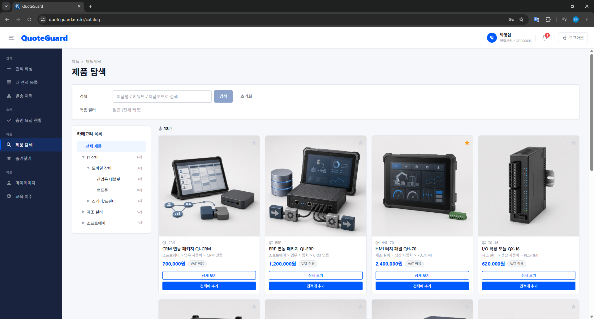
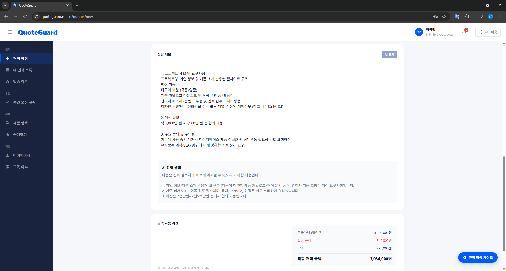
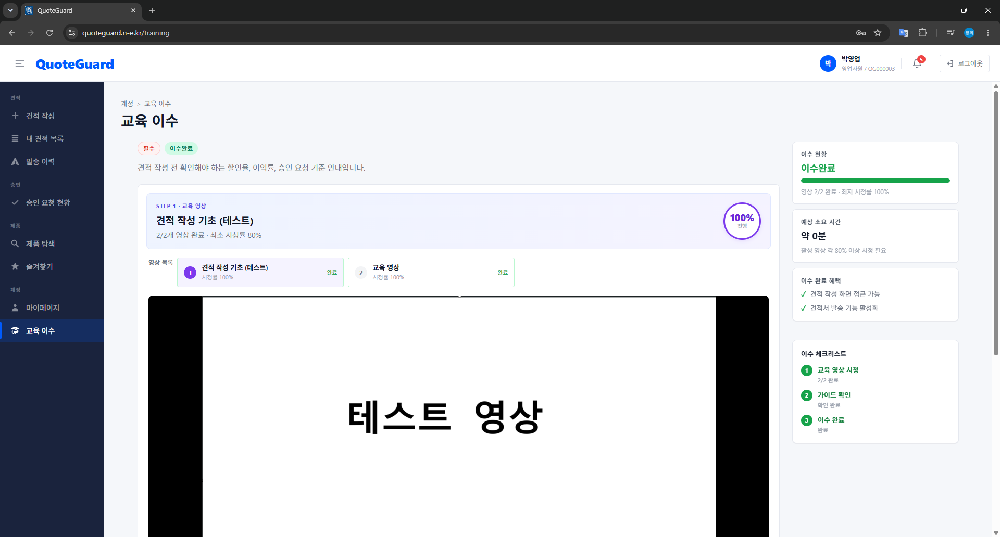
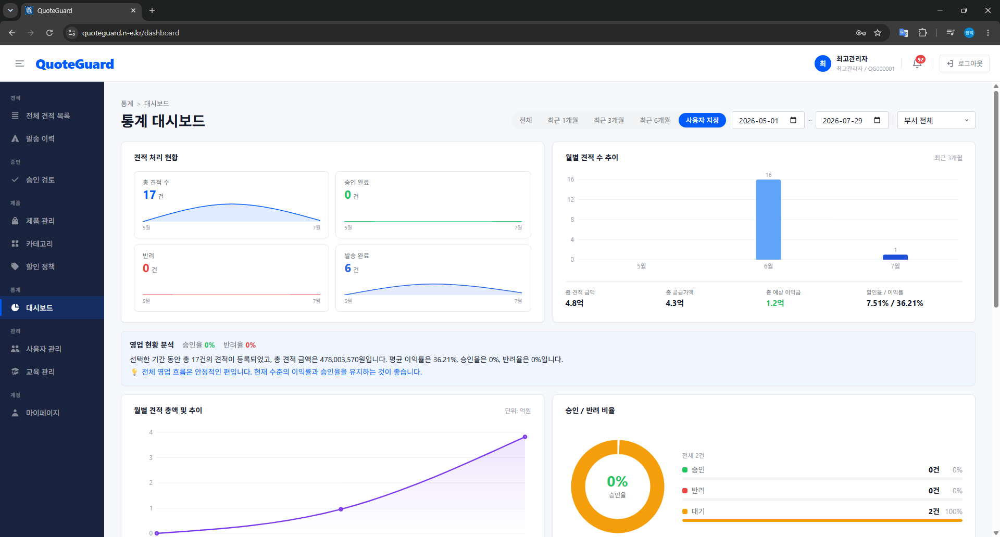
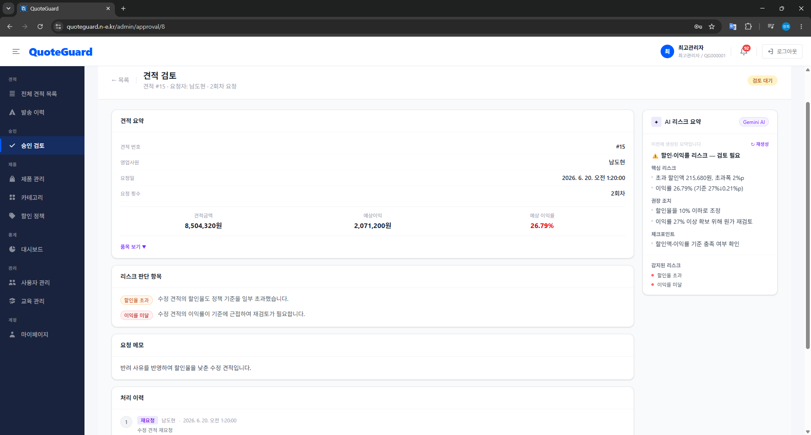
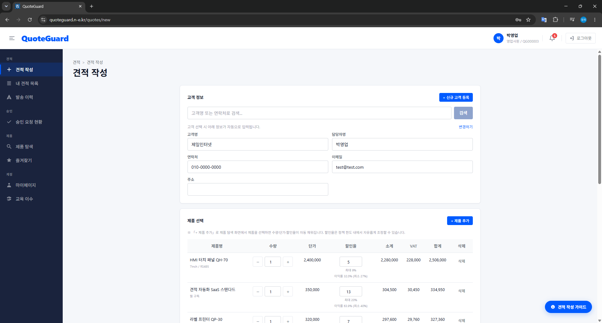
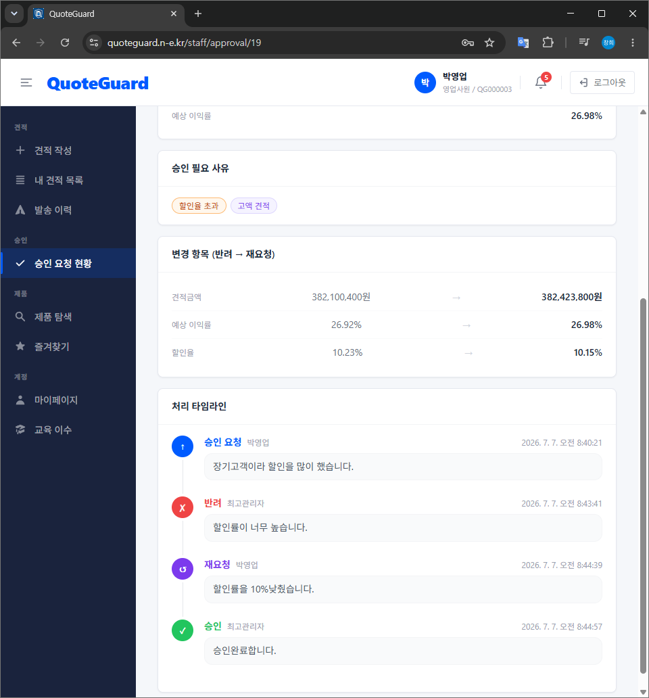
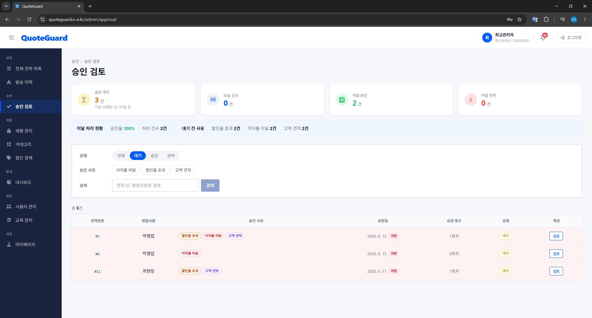
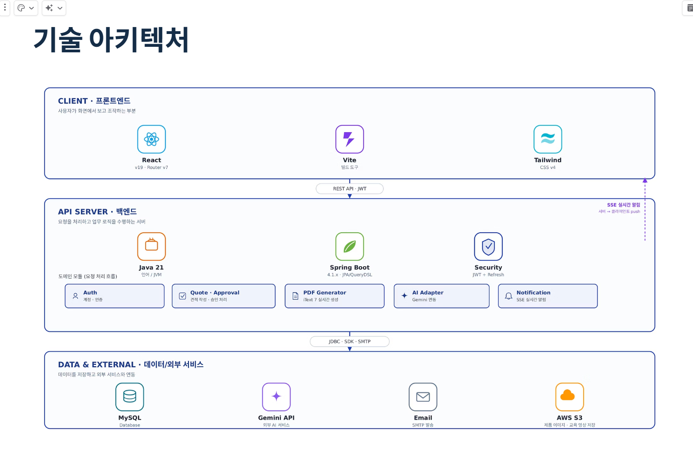
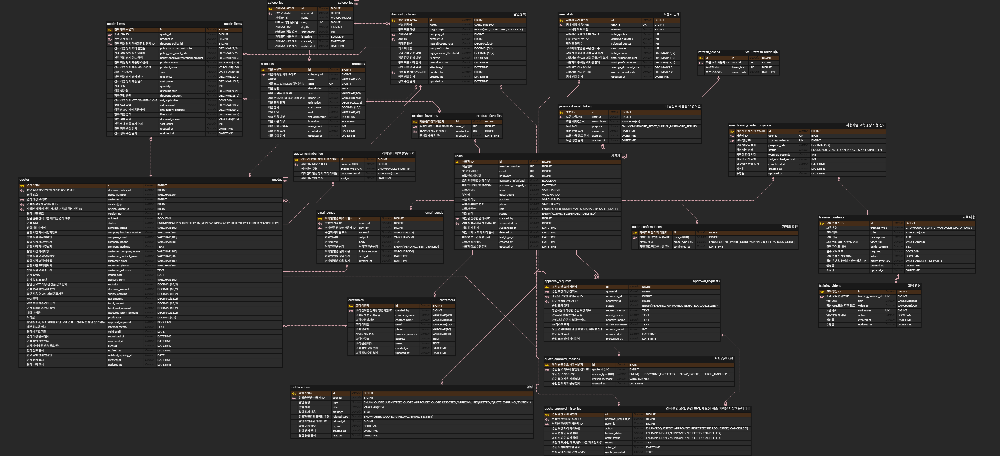

# QuoteGuard

> 할인율·이익률·견적 금액을 기준으로 승인 필요 여부를 자동 판정하고, 견적 작성부터 승인·발송까지의 이력을 관리하는 B2B 영업 견적 플랫폼입니다.

- **프로젝트 기간**: 2026.06.10 ~ 2026.07.08
- **팀 구성**: 6인 (백엔드·프론트엔드 통합)
- **역할**: 팀장 / 계정 관리 · 인증·인가 · 사용자 통계 · CI/CD
- **배포**: [quoteguard.n-e.kr](https://quoteguard.n-e.kr) <sup>※ 비용·운영 상황에 따라 일시 중단될 수 있습니다</sup>
- **테스트 계정**: 영업사원 [`demo.staff@quoteguard.com` / `salesDemo26!`] · 승인권자 [`demo.manager@quoteguard.com` / `managerDemo26!`] <sup>※ 매일 자정 데이터 초기화</sup>
- **시연 영상**: [YouTube에서 보기](https://www.youtube.com/watch?v=8z_dxq2jHhA)

> 이 저장소는 6인 팀 프로젝트의 백엔드와 프론트엔드 저장소를 개인 포트폴리오 용도로 통합한
> 저장소입니다. `backend/`, `frontend/` 디렉터리는 `git subtree`로 가져와 각 폴더의 원본 커밋
> 이력을 그대로 유지하고 있습니다.
> - 팀 원본 백엔드 저장소: https://github.com/QuoteGuards/back
> - 팀 원본 프론트엔드 저장소: https://github.com/QuoteGuards/front

---

## 문제 정의

수량·단가·할인·VAT를 반영한 견적 금액 자동 계산 자체는 기존 견적 도구에서도 이미 가능합니다. 문제는 계산 **이후** 단계였습니다.

- 할인율·이익률·고액 여부에 대한 검토가 담당자마다 제각각이라, 저이익 견적이 별도 검토 없이 통과될 위험이 있었습니다.
- 원가·예상 이익금 같은 내부 정보가 고객용 견적 정보와 분리되지 않아 관리가 어려웠습니다.
- 수정·승인·반려·발송 이력이 여러 채널에 흩어져 있어 사후 확인과 감사가 불편했습니다.

QuoteGuard는 수량·단가·할인·VAT를 자동 계산하고, 할인율·이익률·총액을 기준으로 승인 필요 여부를 자동 판정합니다. AI 리스크 요약은 승인 여부를 대신 결정하지 않고, 관리자가 주요 위험 요소를 빠르게 파악해 승인 검토를 하도록 돕는 보조 지표로만 제공합니다.

---

## 담당 영역

### Backend (`backend/`)

- 계정 생성 및 사용자 관리 (`AdminUserController`, `MyProfileController`)
- JWT(Access + Refresh) 기반 인증·인가
- 이메일 링크 기반 초기 비밀번호 설정, 비밀번호 재설정
- 사용자별·부서별 통계 (`UserStatsController`, 대시보드 통계 일부)
- GitHub Actions + Docker 기반 CI/CD

인증·사용자·통계 영역에서 API 20개(`AuthController` 6, `AdminUserController` 9, `MyProfileController` 3, `UserStatsController` 2)를 구현했습니다.

### Frontend (`frontend/`)

- 로그인 화면 — `src/pages/login/`
- 초기 비밀번호 설정·비밀번호 재설정 화면 — `src/pages/auth/`
- 마이페이지 비밀번호 변경 검증(정책 검증, 확인 불일치, 현재 비밀번호와 동일 여부 차단) — `src/pages/mypage/MyPage.jsx`
- 최고관리자 사용자 관리 화면(목록·생성·수정) — `src/pages/admin/UserManagementPage.jsx`
- 역할 기반 라우팅 접근 제어 — `src/router/ProtectedRoute.jsx`
- 전체 UI/UX 레이아웃 통일 작업의 일부로 대시보드 화면 개선에 기여 — `src/pages/dashboard/DashboardPage.jsx` (데이터 연동·차트 등 주 구현은 팀원)

아래 "주요 기능"은 팀 전체 기능이며, 담당자는 "팀원 역할 분담"에 별도로 표시했습니다.

---

## 주요 기능

### 1. 계정·권한·운영 관리

- 관리자에 의한 계정 생성 방식으로 운영하며, 사용자 셀프 회원가입은 제공하지 않음
- JWT 로그인/갱신, 초기 비밀번호 설정·비밀번호 재설정
- 역할 기반 접근 제어 (`SUPER_ADMIN` / `SALES_MANAGER` / `SALES_STAFF`)
- 관리자 사용자 CRUD, 사용자별·부서별 통계
- 관리자 대시보드, 인앱 알림(SSE)

### 2. 견적 작성

- 견적 CRUD, 임시저장(`DRAFT`), 만료된 견적 재작성
- 기존 견적을 복사하여 신규 견적으로 재작성 가능
- 품목별 할인·VAT·이익률 등 자동 계산 (프론트는 미리보기, 최종 계산·저장은 백엔드)
- 작성완료(`SUBMITTED`) 시 할인율 초과·저이익·고액 여부를 기준으로 승인 필요 여부(`APPROVAL_PENDING` / `APPROVAL_NOT_REQUIRED`) 자동 판정
- 할인 정책 스냅샷 저장, 할인 사유 검증 (경고·입력 UX는 프론트, 최종 검증은 백엔드)
- 작성한 견적 내용 바탕으로 내부 견적 분석 (원가·이익·정책 대비)
- 고객 등록 및 검색, 기존 고객 정보 자동 입력

### 3. 승인 관리

- 승인 필요 견적에 대한 승인 요청·승인·반려·재요청·요청 철회
- 승인·반려 결과 및 검토 의견 이력 관리
- SLA를 초과한 승인 대기 건에 대한 인앱 알림 제공

### 4. 제품 및 할인 정책 관리

- 관리자가 제품명, 제품코드, 설명, 이미지, 단가, 원가, VAT 적용 여부를 관리
- 대분류, 중분류, 소분류 카테고리를 등록·수정
- 카테고리, 제품명, 키워드, 제품코드로 제품을 검색
- 자주 사용하는 제품은 즐겨찾기로 등록

### 5. 견적 문서 관리 및 발송

- 견적 PDF 실시간 생성(백엔드, iText7), 프론트에서 미리보기
- 엑셀 다운로드는 프론트엔드에서 xlsx 라이브러리로 클라이언트 생성 (백엔드 API 없음)
- 견적 이메일 발송·발송 이력 확인
- 견적 만료 알림(인앱)

### 6. 교육(LMS)

- 교육 영상 이수 현황, 가이드 확인
- 관리자 교육 가이드·영상 관리
- 영업 사원, 영업 관리자는 교육 이수 완료 시에만 견적 작성, 승인 검토 가능

### 7. AI 보조 지원

- AI 리스크 요약 — Gemini API가 호출 한도를 초과하면 Groq로 대체 응답을 시도하는 fallback 구성 (백엔드)
- 승인 상세 화면에서 AI 리스크 요약 조회·재생성 (프론트)
- AI 상담 메모 요약, 고객 제안 문구 생성·편집

---

## 주요 화면

<p>
  
  
  
</p>
<p>
  
  
  
</p>
<p>
  
  
</p>

추가 화면과 전체 시연 흐름은 [시연 영상](https://www.youtube.com/watch?v=8z_dxq2jHhA)에서 확인할 수 있습니다.

---

## 기술 스택

### Backend

- **Java 21**, **Spring Boot 4.1.0**
- **JPA/Hibernate**, **QueryDSL 5.1.0** (Jakarta)
- **MySQL 8**, **JWT** (Access + Refresh, jjwt)
- Spring Security, Spring Validation, Spring Mail
- Gradle (빌드 도구)
- iText7-core 8.0.4 (PDF 생성)
- AWS S3
- Gemini / Groq (AI 리스크 요약)
- spring-dotenv (`.env` 로컬 환경 변수)

### Frontend

- **React 19**, **Vite 8**
- **React Router 7**
- axios (HTTP 클라이언트)
- Context API — 인증 사용자 및 교육 이수 상태 관리
- Tailwind CSS 4 + CSS
- recharts (대시보드 차트)
- xlsx (견적 엑셀 다운로드)
- ESLint (린트), CodeRabbit (AI 코드 리뷰)

### 시스템 구성

| 구분     | 기술                                              |
| -------- | ------------------------------------------------- |
| Frontend | React, Vite, React Router (`frontend/`)           |
| Backend  | Spring Boot REST API (`backend/`)                 |
| DB       | MySQL (`backend/sql/QuoteGuard.sql`)               |
| CI/CD    | GitHub Actions, Docker Compose, GHCR               |
| 외부     | AWS S3, SMTP, Gemini/Groq API                      |

> 견적 금액·승인 최종 판정은 **백엔드** 기준입니다. 프론트는 미리보기·경고·사유 입력 UX를 담당합니다.

---

## 아키텍처 개요



- React 프론트엔드와 Spring Boot API 서버를 분리 배포하는 구조입니다.
- 백엔드는 MySQL, AWS S3(파일 저장), SMTP(이메일 발송), Gemini/Groq(AI)와 연동됩니다.
- GitHub Actions에서 Docker 이미지를 빌드해 GHCR에 게시하고, 배포 서버에서 Docker Compose로 pull·재기동합니다.

---

## 핵심 설계 의사결정

**세션 대신 JWT(Access + Refresh)를 선택**

프론트엔드와 백엔드를 독립적으로 배포하고, API 서버의 세션 상태 의존도를 낮추기 위해 JWT 기반 인증을 선택했습니다. Access 토큰은 짧게 유지하고, Refresh 토큰은 원문이 아닌 해시(`token_hash`)로 별도 테이블에 저장해 재발급과 강제 로그아웃을 서버에서 통제할 수 있도록 했습니다. Access 토큰 자체는 서버가 즉시 무효화할 수 없다는 트레이드오프가 있어, 만료 시간을 짧게 유지하고 Refresh 재발급/폐기 로직으로 보완했습니다.

**메뉴 숨김이 아니라 서버 API 인가 검증을 기본으로**

역할별로 접근 가능한 화면이 다르지만, 프론트에서 메뉴만 숨기면 API를 직접 호출해 우회할 수 있습니다. 프론트에서는 `ProtectedRoute.jsx`로 로그인 여부와 역할을 확인해 권한 없는 화면 접근을 1차로 차단하고, 백엔드 `SecurityConfig`에서 역할 기반 접근 제어를 다시 구성해 인증 실패(401)는 `JwtAuthenticationEntryPoint`, 인가 실패(403)는 `JwtAccessDeniedHandler`로 분리해 응답했습니다.

**임시 비밀번호 대신 이메일 링크 기반 초기 설정**

관리자가 임시 비밀번호를 구두·메신저로 전달하는 방식은 유출 위험이 있고, 사용자가 최초 로그인 후 비밀번호를 바꾸지 않고 방치할 가능성도 있었습니다. 계정 생성 시 `passwordInitialized = false`로 시작해, 이메일 링크로만 최초 비밀번호를 설정할 수 있게 했고 그 전에는 로그인 자체를 차단했습니다. 재설정용 토큰과 초기 설정용 토큰은 `TokenPurpose` Enum으로 목적을 구분해, 잘못된 흐름에서 토큰이 소모되지 않도록 했습니다.

---

## CI/CD 및 배포

```text
GitHub main 브랜치 push
    ↓
GitHub Actions (docker-build-push.yml)
    ↓
Docker 이미지 빌드 (Dockerfile)
    ↓
GHCR(ghcr.io/quoteguards/back) 푸시 — latest 태그 + 커밋 SHA 태그
    ↓
SSH로 배포 서버 접속
    ↓
.env의 BACKEND_IMAGE를 이번 커밋 SHA 이미지로 갱신
    ↓
docker compose pull && docker compose up -d back
```

- 이미지를 `latest`가 아닌 커밋 SHA로 고정 배포해, 문제 발생 시 이전 SHA로 즉시 롤백할 수 있도록 설계했습니다.
- 배포 서버 접속 정보(호스트/키/경로)는 GitHub Secrets로 분리해 저장소에 노출되지 않습니다.

---

## ERD

- DB 스크립트: [`backend/sql/QuoteGuard.sql`](backend/sql/QuoteGuard.sql)



## 주요 API (담당 영역)

| Method | Endpoint | 설명 | 권한 |
|---|---|---|---|
| POST | `/api/auth/login` | 로그인 | Public |
| POST | `/api/auth/refresh` | Access Token 재발급 | Public |
| POST | `/api/auth/logout` | 로그아웃(Refresh 토큰 폐기) | 인증 사용자 |
| POST | `/api/auth/password-reset/request` | 비밀번호 재설정 링크 요청 | Public |
| POST | `/api/auth/password-reset/confirm` | 비밀번호 재설정 확인 | Public |
| POST | `/api/auth/set-initial-password` | 초기 비밀번호 설정 | Public |
| GET | `/api/admin/users` | 사용자 목록 조회 | SUPER_ADMIN |
| GET | `/api/users/me/stats` | 내 통계 조회 | 인증 사용자 |

전체 API 명세는 아래 Notion 문서를 참고하세요.

| 문서 | 링크 |
| --- | --- |
| API 명세 (Notion) | [바로가기](https://app.notion.com/p/38325e891fd6800ea3d9d2ade1b37086?v=38325e891fd6804d9628000c1f0def61) |
| 비즈니스 규칙 (Notion) | [바로가기](https://app.notion.com/p/df525e891fd68231bd8901734511bba2) |

> Notion 문서는 워크스페이스 공개 설정에 따라 외부 접근이 제한될 수 있습니다.

---

## 주요 화면 경로 (Frontend)

| 경로 | 역할 | 설명 |
|------|------|------|
| `/login` | 공통 | 로그인 |
| `/quotes` | 인증 사용자 | 권한에 따른 견적 목록 |
| `/quotes/new` | 사원·관리자 | 견적 작성 |
| `/quotes/:quoteId/detail` | 인증 사용자 | 권한에 따른 견적 상세 |
| `/quotes/analysis/:quoteId` | 인증 사용자 | 내부 견적 분석·승인 요청 |
| `/quotes/:id/preview` | 인증 사용자 | 견적 미리보기·PDF·이메일 |
| `/staff/approval` | 영업사원 | 내 승인 요청 |
| `/admin/approval` | 최고관리자·영업관리자 | 승인 관리 |
| `/catalog` | 사원·관리자 | 제품 검색 |
| `/training` | 사원·관리자 | 교육 이수 |
| `/dashboard` | 최고관리자·영업관리자 | 대시보드 (영업사원은 접근 불가) |
| `/admin/users` | 최고관리자 | 사용자 관리 |

---

## 실행 방법

### 1. 사전 요구 사항

| 항목    | 버전     |
| ------- | -------- |
| JDK     | 21       |
| MySQL   | 8+       |
| Node.js | 18+      |
| Git     | 2.x 이상 |

### 2. 저장소 클론

```bash
git clone https://github.com/partmant/QuoteGuard.git
cd QuoteGuard
```

### 3. DB 준비

```bash
mysql -u root -p -e "CREATE DATABASE quoteguard CHARACTER SET utf8mb4 COLLATE utf8mb4_unicode_ci;"
mysql -u root -p quoteguard < backend/sql/QuoteGuard.sql
```

### 4. 백엔드 환경 설정

`backend` 폴더에 `.env` 파일을 생성하고 다음 정보를 입력합니다.

```env
# ── Database ──
# DB 이름은 application.properties에 quoteguard로 고정되어 있습니다.
# 다른 이름을 쓰려면 spring.datasource.url을 직접 수정해야 합니다.
DB_USERNAME=
DB_PASSWORD=

# ── JWT ── (512bit base64 문자열)
JWT_SECRET=

# ── Mail (SMTP) ──
MAIL_HOST=smtp.gmail.com
MAIL_PORT=587
MAIL_USERNAME=
MAIL_PASSWORD=
MAIL_FROM=
MAIL_FROM_NAME=QuoteGuard

# ── File Storage ── local 또는 s3 중 하나만 선택
STORAGE_TYPE=local
# local일 때
STORAGE_PUBLIC_BASE_URL=http://localhost:8080
STORAGE_LOCAL_DIR=./uploads
# s3일 때 (STORAGE_TYPE=s3 로 변경 후 아래 값 입력)
S3_BUCKET=
S3_REGION=ap-northeast-2
AWS_ACCESS_KEY_ID=
AWS_SECRET_ACCESS_KEY=
S3_PUBLIC_URL=

# ── Gemini / Groq (AI) ──
GEMINI_API_KEY=
GROQ_API_KEY=
```

### 5. 백엔드 실행 (API 기본 URL: http://localhost:8080)

```bash
cd backend

# Windows
gradlew.bat bootRun

# macOS / Linux
./gradlew bootRun
```

### 6. 백엔드 테스트 실행

```bash
cd backend

# Windows
gradlew.bat test

# macOS / Linux
./gradlew test
```

### 7. 프론트엔드 환경 설정/실행 (프론트 기본 URL: http://localhost:5173)

별도 터미널에서 프로젝트 루트 기준 `frontend` 폴더로 이동합니다.

```bash
cd frontend
npm install
```

`.env` 파일을 생성하고 다음 내용을 입력합니다.

```env
VITE_API_BASE_URL=http://localhost:8080
```

```bash
npm run dev
```

### 8. 접속 확인

1. 백엔드 `http://localhost:8080` 기동 확인
2. 프론트 `npm run dev` 실행
3. 브라우저에서 `http://localhost:5173` 접속 후 로그인

### 프론트엔드 스크립트

| 명령어 | 설명 |
|--------|------|
| `npm run dev` | 개발 서버 |
| `npm run build` | 프로덕션 빌드 |
| `npm run preview` | 빌드 결과 미리보기 |
| `npm run lint` | ESLint 검사 |

---

## 패키지 구조

```
backend/src/main/java/com/project/back/
├── ai/                     # AI 리스크 요약·상담 요약·제안 문구
├── domain/
│   ├── approval/          # 승인 요청·승인·반려·재요청
│   ├── auth/              # 인증·토큰·비밀번호 [담당]
│   ├── category/          # 카테고리
│   ├── customer/          # 거래처
│   ├── dashboard/         # 사용자·부서 통계 [담당 일부]
│   ├── discount/          # 할인 정책
│   ├── document/          # PDF 문서
│   ├── email/             # 견적 이메일·발송 이력
│   ├── product/           # 제품
│   ├── quote/             # 견적·금액 계산·내부분석
│   ├── training/          # 교육 이수
│   └── user/              # 사용자·계정 관리 [담당]
├── notification/          # 인앱 알림·SSE
└── global/                # 보안·예외·공통·스토리지
    ├── client/
    ├── common/
    ├── config/
    ├── enums/
    ├── exception/
    ├── security/          # JWT 인증·인가 [담당]
    └── storage/

.github/workflows/
└── docker-build-push.yml  # Docker 빌드 → GHCR 푸시 → SSH 배포 [담당]

frontend/src/
├── api/              # Axios 인스턴스·도메인별 API 모듈 (17개 파일)
│   ├── apiClient.js       # 공통 인터셉터
│   ├── authApi.js         # 로그인·토큰
│   ├── userManagementApi.js  # 사용자 관리
│   ├── quoteApi.js        # 견적
│   ├── approvalApi.js     # 승인
│   ├── dashboardApi.js    # 통계
│   └── ...                # productApi, discountApi, aiApi, emailApi 등
├── components/       # 재사용 UI
├── constants/        # 상수
├── contexts/         # 전역 상태 (AuthContext, TrainingStatusContext)
├── hooks/            # 커스텀 훅
├── pages/            # 라우트 단위 페이지
│   ├── admin/        # 관리자 전용 화면
│   ├── approval/     # 승인 요청 · 관리자 승인
│   ├── auth/         # 초기 비밀번호 설정 · 비밀번호 재설정
│   ├── catalog/      # 제품 검색 · 즐겨찾기
│   ├── category/     # 카테고리 관리
│   ├── dashboard/    # 통계 대시보드
│   ├── discount/     # 할인 정책 관리
│   ├── history/      # 발송 이력 등 이력 조회
│   ├── login/        # 로그인
│   ├── mypage/       # 마이페이지
│   ├── product/      # 제품 관리
│   ├── quote/        # 견적 작성 · 목록 · 상세 · 내부분석 · 미리보기
│   └── training/     # 교육 이수 · 교육 관리
├── router/           # AppRouter, ProtectedRoute
└── utils/            # quoteItemUtils, excelExport, jwt …
```

---

## 팀원 역할 분담

| 이름   | 역할 | 담당                                                              |
| ------ | ---- | ------------------------------------------------------------------ |
| 홍창희 | 팀장 | 계정 관리, 인증/인가, 사용자 통계, CI/CD                          |
| 박재석 | 팀원 | 제품 관리 및 탐색, 할인 정책 관리, 통계 대시보드                  |
| 박삼령 | 팀원 | 견적 계산 및 작성, 내부 분석, 고객 관리, 임시 저장, 교육(LMS)     |
| 신현섭 | 팀원 | 승인/반려 처리, 재요청, SLA 알림 및 견적 리마인더, AI 리스크 요약 |
| 박준호 | 팀원 | 견적서 미리보기, PDF/엑셀 다운로드, 이메일 발송, 알림(SSE)        |
| 장채은 | 팀원 | 상담 메모 요약, 제안 문구 생성                                    |

---

## 협업

- 코드 리뷰: CodeRabbit
